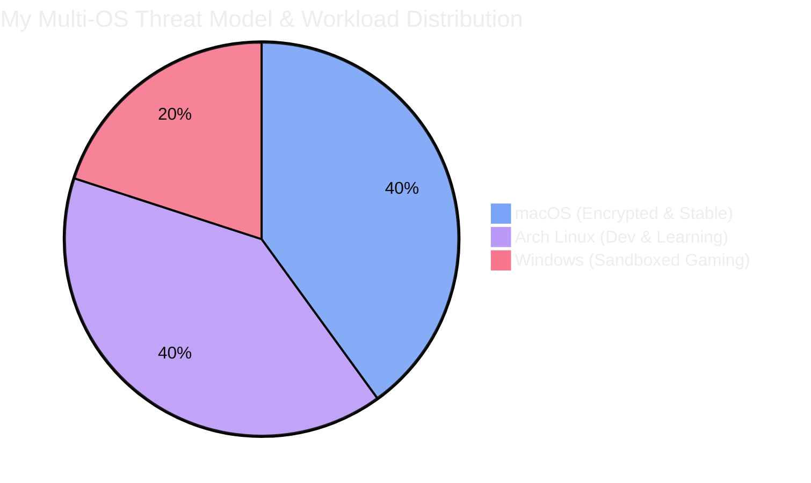

As someone pursuing a career in IT and cybersecurity, I've learned that understanding different operating systems isn't just a nice-to-have, it's essential. Over the past year, I've transitioned from being a Windows-only user to maintaining and actively using all three major operating systems. Here's how each platform transformed my workflow and what I learned along the way.

## The Windows-to-Mac Transition

My first major shift came when I moved from Windows to macOS for my primary study machine as my high school laptop broke.  Simple things like keyboard shortcuts, file management, and even window controls felt alien. The command key vs. control key confusion alone cost me hours of muscle memory retraining.

The lack of bloatware was immediately noticeable. No pre-installed games, no constant vendor software trying to "optimize" my system, no mysterious background processes eating up resources. macOS gave me a clean slate that just _worked_ perfectly for when I needed to focus on coursework and documentation without distractions.

Today, my MacBook serves as my primary machine for:

- **Study and school work** - the stability means fewer "why won't this work" moments during crunch time
- **Document management** - Time Machine backups give me peace of mind for important files
- **Sensitive information** - FileVault encryption and the robust security model make it ideal for storing critical data

## The Arch Linux Deep Dive

After getting comfortable with macOS, I decided to install Arch Linux as I wanted to have a dual boot of two different OS in there, only isolated containers. For those unfamiliar, Arch doesn't hold your hand; there's no graphical installer, just you, a command line, and the Arch Wiki.

The installation process was genuinely difficult. I must have reinstalled three times before I got a bootable system with proper drivers. Configuring everything manually—from the bootloader to networking to display managers—was time-consuming and occasionally frustrating. But here's the thing: **every error message taught me something new**.

Then I discovered Hyprland, a dynamic tiling Wayland compositor. This is where productivity went through the roof. Instead of manually arranging windows, Hyprland automatically tiles everything. Combined with keyboard-driven workflows, I rarely touch my mouse anymore. My project development speed increased noticeably because I spend less time context-switching and more time actually coding.

My Arch Linux setup now handles:

- **School projects** - the terminal-centric workflow is perfect for development
- **Experimentation** - breaking things (and fixing them) teaches me more than any tutorial
- **Minimal personal data** - if I mess up and need to reinstall, I'm not losing anything critical

## Windows Still in the Rotation

Despite my Unix adventures, Windows remains part of my setup for specific use cases:

- **Gaming** - let's be real, nothing beats Windows for game compatibility
- **Certain development workflows** - some tools still work best on Windows
- **Zero personal data** - I treat this as a sandboxed environment, as running certain software has my trust in other people, and there is only so much I can do. 

Note: I plan to ditch Windows internally when I harden my VMs to be able to run kernel-level anti-cheats. So this current setup will change; it's not the most optimal, but it works.

## The Security Mindset: Data Segmentation

From a cybersecurity perspective, this multi-OS approach has taught me to think about data segmentation naturally. 

My most sensitive information lives on my encrypted Mac. My development work happens on Arch where I have full control over every service and port. Windows serves as an isolated environment for recreation.

This isn't just about using different operating systems—it's about understanding the threat model for each use case and matching the platform to the task.

For anyone considering a career in IT or cybersecurity, I can't recommend experimenting with multiple operating systems enough. Each platform teaches you different lessons about system architecture, security models, and user experience design. Yes, it's challenging. Yes, you'll break things. But that's exactly where the learning happens.
