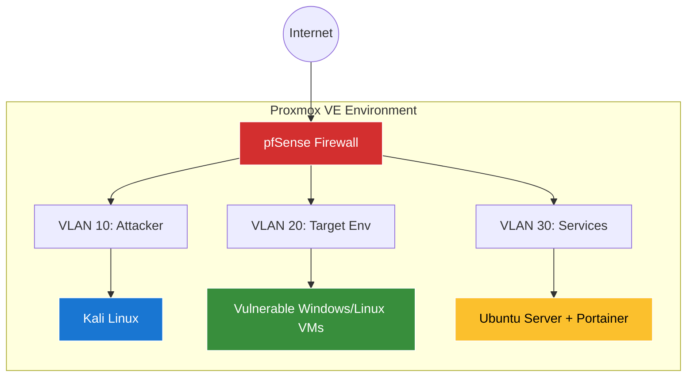

## Why am I doing this

I had a spare laptop that wasn't being used, so I repurposed it and thought this would be a great way to improve my skills. This is the video I am following for now: https://www.youtube.com/watch?v=XIvn0ZDSmKA

## How to install Proxmox 

1. **Download Proxmox VE ISO**: I grabbed the latest ISO from proxmox.com.
2. **Create Bootable USB**: Using Rufus on a Windows machine, I created a bootable USB drive with the Proxmox ISO.
3. **Backup Data**: Since Proxmox requires a full disk wipe, I backed up all important data from my laptop to an external drive.
4. **Install Proxmox**:
    - Booted from the USB drive by entering the laptop’s BIOS/UEFI (usually F2 or Del key).
    - Followed the Proxmox installer, selecting my SSD as the target drive.
    - Configured a static IP address (e.g., 192.168.1.100) for easy access.
    - Completed installation and rebooted.
5. **Access Proxmox**: From another device , I accessed the web interface at https://192.168.1.100:8006 and logged in with the root credentials.

### Getting Started: 

In this first episode, Gerard walks us through the initial setup, which includes:
1. **Setting up the pfSense Firewall:** He shows us how to install and configure the pfSense firewall, which will be the backbone of our lab's network.
2. **Installing Kali Linux:** Next, he guides us through the installation of Kali Linux, the go-to operating system for penetration testing and ethical hacking.
3. **Deploying the Docker Environment:** Finally, he sets up an Ubuntu server and installs Docker and Portainer, which will be used to manage containerised applications in the lab.

### Network Segmentation is Key

A crucial part of this lab is the network design. Gerard emphasises the importance of segmenting the network using VLANs to keep everything organized and secure. The lab will be set up behind a **pfSense firewall**, with different VLANs for the security tools, vulnerable machines, Windows environment, and Docker containers.

