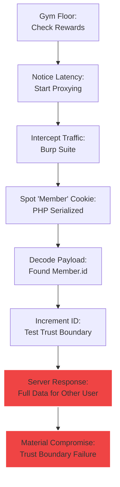
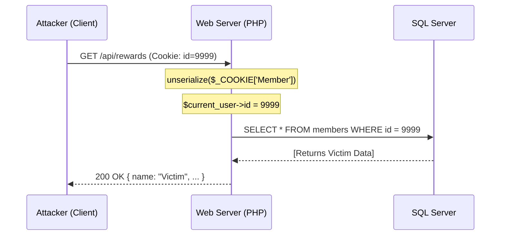

## Executive Summary

This assessment started as a routine review of the RevoFitness Android application and quickly turned into a full account-takeover style finding. What first looked like a normal session cookie ended up being a client-controlled PHP serialized object, and that object was trusted by the backend as the primary identity source.

Once I confirmed that the `Member.id` value could be altered without server-side validation, the rest of the application began to unravel. The same trust boundary failure exposed member data, allowed state changes against other accounts, and opened a path to stacked SQL injection in the raffle workflow.

## How I Found It: The Curious Cookie

I originally approached the target like a normal mobile app recon task. The goal was not to break authentication on day one; it was to understand how the app handled identity, session state, and requests between the Android client and the backend portal. 

I was sitting in the gym, checking my rewards points, when I noticed the app felt... sluggish. My instinct as an analyst is to wonder *why*. I fired up Burp Suite on my laptop, set my phone's proxy, and started watching the traffic.

The first useful lead came from proxying a few low-risk profile requests. Most modern apps use JWTs or opaque tokens. Revo was different. It issued a `Member` cookie that looked like gibberish at first glance, but the `%3A` and `%7B` characters gave it away: it was URL-encoded PHP serialization. 

> "When you see serialized objects in a cookie, you stop looking for bugs and start looking for the front door."

I decoded the cookie and saw my own `id` staring back at me: `s:2:"id";s:4:"8421";`. On a whim, I changed the `8421` to `8422` and replayed the request. I didn't expect it to work. I expected a `403 Forbidden` or a session mismatch error. Instead, the server responded with the full name, email, and barcode of the next member in the database. 

The "aha" moment was realizing that the backend wasn't validating the session against a database; it was simply reconstituting the object I sent and using its `id` as the absolute truth.



## Validation Workflow

To keep the test controlled, I worked from the least invasive checks to the highest impact checks:

1. **Format Confirmation**: Decoded the serialized payload to ensure I understood the object structure.
2. **Horizontal Escalation**: Replayed read-only requests (rewards, profile) with different numeric IDs.
3. **Identity Assumption**: Validated that the server's entire "view" of the world changed based on that one cookie value.
4. **Endpoint Probing**: Tested state-changing endpoints (raffle entries, password resets) to see if they reused the same identity assumption.
5. **Injection Exploration**: Checked whether the identifier—which was clearly being dropped into database queries—was handled safely.

## Cookie Trust Boundary Failure

The central weakness was the backend's treatment of the `Member` cookie as a source of truth rather than an untrusted client artifact.

```text
Cookie: Member=O%3A6%3A%22Member%22%3A1%3A%7Bs%3A2%3A%22id%22%3Bs%3A4%3A%229999%22%3B%7D
Decoded: O:6:"Member":1:{s:2:"id";s:4:"9999";}
```

This structure meant the application was effectively saying, "tell me who you are, and I will believe you." There was no evidence of a server-side lookup that bound the cookie to a signed session.



## Exploit Chain & SQLi

Once the cookie weakness was established, the escalation to SQL injection was almost inevitable. Because the `id` was trusted and likely used to build dynamic queries, it provided a perfect injection vector.

During follow-up testing of the raffle workflow, I observed behavior consistent with **stacked SQL injection**. A time-delay payload (`WAITFOR DELAY '0:0:5'`) produced a measurable response delay, indicating that attacker-controlled input was being concatenated into a SQL Server query without parameterization.

<svg viewBox="0 0 580 200" width="100%" role="img" aria-label="Exploit escalation timeline">
  <defs>
    <marker id="arrow" markerWidth="6" markerHeight="6" refX="5" refY="3" orient="auto">
      <path d="M0,0 L0,6 L6,3 z" fill="rgba(255,255,255,0.18)"/>
    </marker>
  </defs>
  <style>
    .node-text { fill: #ededed; font: 500 11.5px Inter, sans-serif; }
    .sub-text  { fill: #555;    font: 10px Inter, sans-serif; }
    .tick-line { stroke: rgba(255,255,255,0.08); stroke-width: 1.5; stroke-dasharray: 4 3; }
  </style>

  <!-- Background -->
  <rect x="0" y="0" width="580" height="200" fill="#0a0a0a" rx="12"/>

  <!-- Horizontal spine -->
  <line x1="50" y1="100" x2="542" y2="100"
        stroke="rgba(255,255,255,0.1)" stroke-width="2"
        marker-end="url(#arrow)"/>

  <!-- ── Step 1: Recon ── -->
  <line x1="80" y1="100" x2="80" y2="70" class="tick-line"/>
  <circle cx="80" cy="100" r="5" fill="#ededed"/>
  <text x="80" y="62"  text-anchor="middle" class="node-text">Recon</text>
  <text x="80" y="126" text-anchor="middle" class="sub-text">Traffic Proxying</text>

  <!-- ── Step 2: Discovery ── -->
  <line x1="185" y1="100" x2="185" y2="130" class="tick-line"/>
  <circle cx="185" cy="100" r="5" fill="#ededed"/>
  <text x="185" y="148" text-anchor="middle" class="node-text">Discovery</text>
  <text x="185" y="62"  text-anchor="middle" class="sub-text">Serialized Cookie</text>

  <!-- ── Step 3: IDOR ── -->
  <line x1="295" y1="100" x2="295" y2="70" class="tick-line"/>
  <circle cx="295" cy="100" r="5" fill="#ededed"/>
  <text x="295" y="62"  text-anchor="middle" class="node-text">IDOR</text>
  <text x="295" y="126" text-anchor="middle" class="sub-text">Account Takeover</text>

  <!-- ── Step 4: SQLi (danger) ── -->
  <line x1="400" y1="100" x2="400" y2="130" class="tick-line"/>
  <circle cx="400" cy="100" r="7" fill="#ef4444"/>
  <!-- outer glow ring -->
  <circle cx="400" cy="100" r="11" fill="none" stroke="#ef4444" stroke-width="1" opacity="0.3"/>
  <text x="400" y="148" text-anchor="middle" class="node-text" fill="#ef4444">SQLi</text>
  <text x="400" y="62"  text-anchor="middle" class="sub-text">Database Access</text>

  <!-- ── Step 5: Disclosure ── -->
  <line x1="500" y1="100" x2="500" y2="70" class="tick-line"/>
  <circle cx="500" cy="100" r="5" fill="#ededed"/>
  <text x="500" y="62"  text-anchor="middle" class="node-text">Disclosure</text>
  <text x="500" y="126" text-anchor="middle" class="sub-text">Source Exposed</text>
</svg>

## Impact Overview

The combined impact was severe because the issues were not isolated. Each one strengthened the next:

- **IDOR**: Exposed sensitive member data (Emails, Phone Numbers, Physical addresses).
- **Broken Authorization**: Enabled cross-account actions, including raffle manipulation.
- **SQL Injection**: Increased the risk from data exposure to full database compromise via stacked queries.
- **Source Disclosure**: Direct access to PHP source files exposed internal procedural logic.

## Remediation Roadmap

The fix needs to be architectural, not cosmetic:

1. **Session Refactor**: Replace the serialized `Member` cookie with a signed, server-side session model (e.g., Redis-backed sessions).
2. **Identity Verification**: Enforce authorization on every member-facing endpoint. Never trust a client-supplied identifier for sensitive actions.
3. **Parameterized Queries**: Refactor all database access to use prepared statements with strict parameter binding.
4. **Access Control**: Remove direct access to internal PHP resources and disable verbose error reporting in production.
5. **Auditing**: Implement logging for cross-account access attempts and unusual identifier patterns.

## Closing Assessment

The most important lesson from this case was how much risk can be introduced when convenience wins over trust boundaries. I did not need an advanced exploit chain to reach impact. I only needed the application to believe data that came from the client.

Once that trust was established, the rest of the vulnerabilities aligned behind it like a row of falling dominoes.

