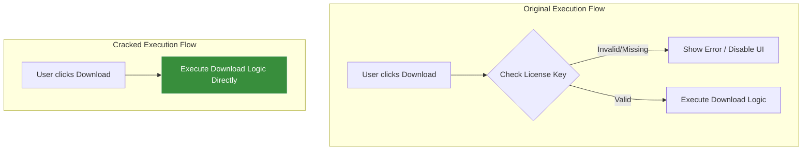

*Repo*:
https://github.com/agxinoia/skool-downloader
### Process
The reversing process was not complex but rather a straightforward removal of the client-side code responsible for the check.

**Removal of Validation Logic:**
The core of the "crack" was to identify and delete the JavaScript code that performs the license key validation. This logic was most likely contained within the pop-up's original JavaScript file. The modified popup-enhanced.js shows no traces of any functions related to:

 - Sending a license key to a server.
 - Receiving an activation status.
 - Storing or checking a local "activated" flag in Chrome storage.
 - Disabling the download button or other UI elements based on license status.

