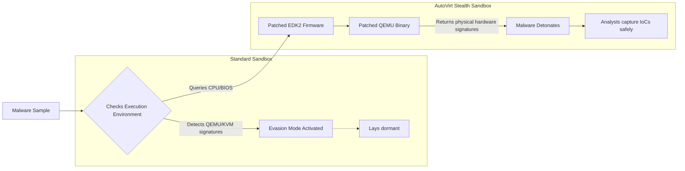

## Overview

As a cybersecurity analyst, a core part of my methodology is maintaining a robust homelab. Whether I'm testing incident response playbooks, analyzing threat mitigation strategies, or safely detonating malware to observe its behavior, I need a reliable and isolated environment.

Recently, while looking to upgrade my virtualization stack for advanced malware analysis, I stumbled upon a fantastic open-source project: Scrut1ny/AutoVirt.

Here is a breakdown of what AutoVirt is, why it's incredibly useful for security professionals, and how I went about setting it up on my Arch Linux host.

## What is AutoVirt?

At its core, AutoVirt is a collection of automated bash scripts designed to simplify complex Linux virtualization tasks. If you've ever dealt with KVM, QEMU, libvirt, and VFIO (for GPU passthrough), you know how tedious the XML configurations and patching can get.

For a SOC analyst or security researcher, AutoVirt offers something even more valuable: Hypervisor evasion capabilities. Advanced malware often queries system hardware, checking for hypervisor fingerprints (like specific CPU cpuid flags, MAC address vendors, or RDTSC timing anomalies) to detect if it's running in a sandbox. If the malware realizes it's being watched, it will lay dormant.

AutoVirt helps bypass this by automating the patching of QEMU and EDK2 (OVMF firmware) to strip away these virtual machine fingerprints, creating a "stealthy" sandbox.



## The Setup Process on Arch Linux

Since my primary daily driver and homelab host runs on Arch Linux, I was curious to see how AutoVirt's scripts would handle a rolling-release distribution. Fortunately, diving into the source code (`main.sh`), I saw that the project explicitly checks for Arch and utilizes `pacman` for dependency resolution.

Here is how the setup went down:

### 1. Preparation

Before cloning the repo, I made sure my system was prepped for IOMMU (Input/Output Memory Management Unit), which is critical if you want to pass hardware directly to the VM. I updated my GRUB bootloader parameters to include `amd_iommu=on iommu=pt` (use `intel_iommu=on` if you're on Intel).

### 2. Cloning the Repository

Fetching the script is straightforward. I opted for a shallow clone to grab the latest branch:

```bash
git clone --single-branch --depth=1 https://github.com/Scrut1ny/AutoVirt
cd AutoVirt/
```

### 3. Execution and the Interactive Menu

AutoVirt is entirely script-driven. Running the main executable requires standard user privileges (the script explicitly blocks running as root initially to prevent accidental system-wide breakage, elevating only when necessary).

```bash
./main.sh
```

Upon execution, you are greeted with a clean, terminal-based UI with several modules:

- **Virtualization Setup**: Installs the base KVM/QEMU/libvirt stack.
- **QEMU (Patched) Setup**: Compiles QEMU from source with anti-detection patches.
- **EDK2 (Patched) Setup**: Patches the UEFI firmware to hide VM strings.
- **GPU Passthrough Setup**: Automates VFIO bindings.

## Arch-Specific Hurdles & Takeaways

Running complex compilation scripts on Arch Linux is always an adventure because of the bleeding-edge kernel and toolchains. Here are a few things I learned during the process:

- **Kernel Headers**: You absolutely must ensure your `linux-headers` package matches your currently running kernel. If you've recently run `pacman -Syu` but haven't rebooted, the AutoVirt scripts might fail when trying to build or bind specific kernel modules.
- **Compilation Time**: Patching QEMU and EDK2 means compiling them from source. On my homelab rig, this took a bit of time, but the automated terminal output provided by AutoVirt’s `utils.sh` logging made it easy to track what was happening under the hood.
- **AppArmor/SELinux**: While Arch doesn't enforce these strictly by default compared to Debian/Fedora, making sure your libvirt permissions are correctly assigned to your user group (`usermod -aG libvirt $(whoami)`) is crucial before deploying the generated XML files.

## Security Implications: Why this matters

From a defensive perspective, building this environment was an excellent exercise in understanding how threat actors evade detection. By seeing exactly what AutoVirt patches out of the QEMU binary (like SMBIOS strings, ACPI tables, and hypervisor CPU flags), I gained a better understanding of what sophisticated malware looks for.

In my day-to-day SOC training, analyzing the "Identify, Protect, Detect, Respond, Recover" lifecycle is paramount. Having a highly convincing, hardware-backed, and stealthy virtual machine allows me to confidently detonate ransomware and persistent threats in a safe, sandboxed environment without tipping off the malware.

## Conclusion

If you are running a homelab and want to dive deeper into malware analysis, reverse engineering, or just want a native-feeling Windows VM via GPU passthrough, I highly recommend checking out AutoVirt. Setting it up on Arch Linux took a bit of patience during the compilation phases, but the resulting stealth sandbox is an invaluable asset to my cybersecurity toolkit.
